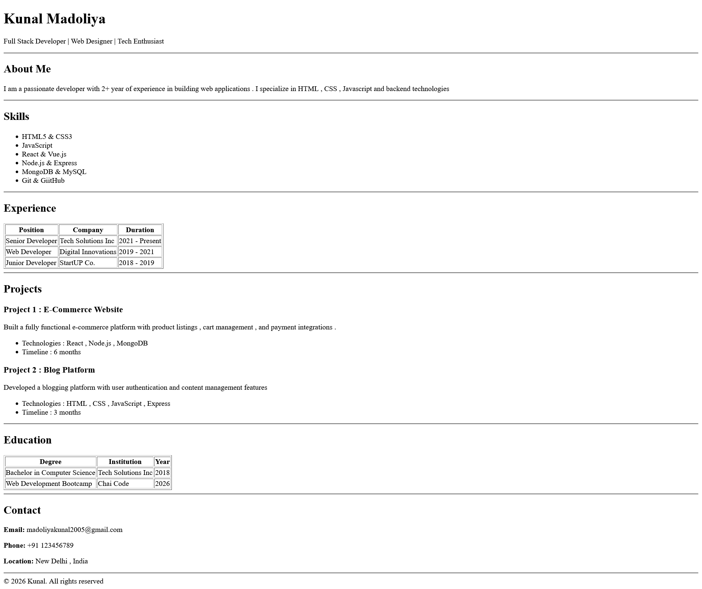

#  chaiAurHTML

A simple **HTML Resume Page** built for the **Web Dev Cohort 2026 assignment**.

---

##  Project Overview

This project demonstrates a clean and semantic **HTML-only resume layout**,  correct usage of HTML tags.  
No CSS frameworks or JavaScript are used.

---

##  Evaluation & Viewing Options

This project can be reviewed in multiple formats:

### 🔹 Live Website (Recommended)
View the resume directly in the browser. No setup required.

https://chaiaurhtml.netlify.app/

---

### 🔹 Source Code (GitHub)
The complete HTML source code is available in this public repository for structure and semantic review.

Files included:
- `index.html`
- `README.md`

---

### 🔹 Demo
A short demo is shared for quick preview.

https://x.com/Kunalmadoliya/status/2016408895787565312?s=20

---

### 🔹 Screen shot
Screen shot of the page 



---


##  Setup & Usage

Follow these steps to run the project locally:

### 1️⃣ Clone the repository
```bash
git clone https://github.com/Kunalmadoliya/chaiAurHTML
```
### 2. Open the project folder

### 3. Run the project Open index.html in any web browser